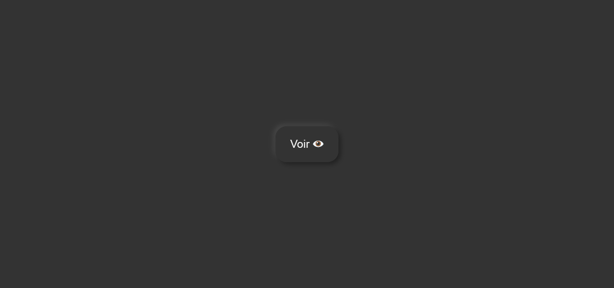

## EFFET NEOMORPHISME SUR UN BOUTON

## Le challenge

Création d'un effet neomorphisme sur un bouton via la propriété box-shadow.

## Démonstration

Lien vers le projet : https://aperbet56.github.io/effet_neomorphisme/

## Projet développé avec

- Utilisation des balises sémantiques HTML5
- CSS3
- Flexbox
- Utilisation d'un normaliseur
- Page web responsive
- Desktop first
